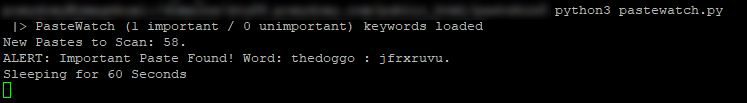
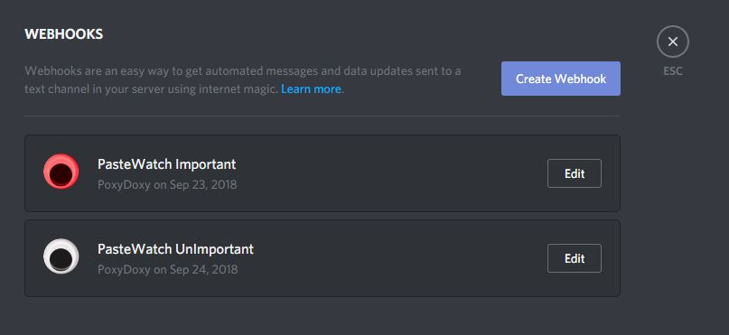

# PasteWatch (with Discord Support)

Watches PasteBin.com for specificed keywords, alerts you on Discord. 

# Why?
* If the supplied keywords are leaked onto pastebin, you'll be the first to know about it!
* Things you could watch for:
    * Your Email Address
    * Your Passwords
    * Your Home Address
    * Your Phone Number
    * Your Username
    * Your Website Name
    * Your Bank Account Number
    * Your Credit Card Number
    * Your IP Address

PasteWatch requires a PasteBin.com LifeTime Account to be able to scrape so aggressivly using their own API. 
If you try to use other scraping methods to bypass it, they will most likely ban your IP.
This scraper scrapes according to their API reccomendations (100 pastes a minute).

# How to Use
1. Make sure your IP is Whitelisted on your Pastebin.com LifeTime Account.
    - Check https://pastebin.com/scraping to see if it is set. 
2. Create 1 or 2 Discord Webhooks
    - 1 for your Important text channel (#pastebin-important)
    - 1 for your Unimportant text channel (#pastebin-unimportant)
    - Paste both webhooks into the python script where indicated.
3. Install python3, and "requests" using pip3. 
    ```
    apt install python3
    pip3 install requests
    ```
4. Run the Script for the first time `python3 pastewatch.py`, 2 empty folders and 3 txt files will be created. 
5. Fill out your keywords to search for inside the `important` and `unimportant` .txt files, seperated by a newline.
6. Run the script again, and watch it go to work.

##### If you do not get discord notifications, it means your Discord Webhook URL's are WRONG. Double check them.

## Features

* Scans for 2 levels of keywords (IMPORTANT, and UNIMPORTANT), give it at least 1 keyword.
* Notifies you via Discord:
    * Uses Discord Webhooks, very easy and quick to setup/use. 
    * Two Discord Channels, one for important, one for unimportant.
    * Two Discord Notification Settings (one for each channel).
* Saves a copy of the text file to a local folder.
* Uploads text file with your discord notification (see screenshots below).
* Avoids Double Scanning already scanned Pastes, resulting in quicker overall scans. 
* Scans every 60 seconds, up to 100 posts (API Recommendations, can be adjusted).
* Has the ability to loop in script, or can be disabled to be manually called every minute using cron.

### Prerequisites

This has 1 dependancy.
Install any version of python 3 using your local package manager (apt/apt-get for debian).
`apt install python3`
Then install 'requests' using pip3. 
`pip3 install requests`


### Screenshots (Console)



### Screenshots (Discord)
2 Webhooks, 1 for Important, 1 for Unimportant.

Notification Settings, 1 for each channel.

PasteWatch has found one of your Important Keywords!

PasteWatch has found one of your Unimportant Keywords.

